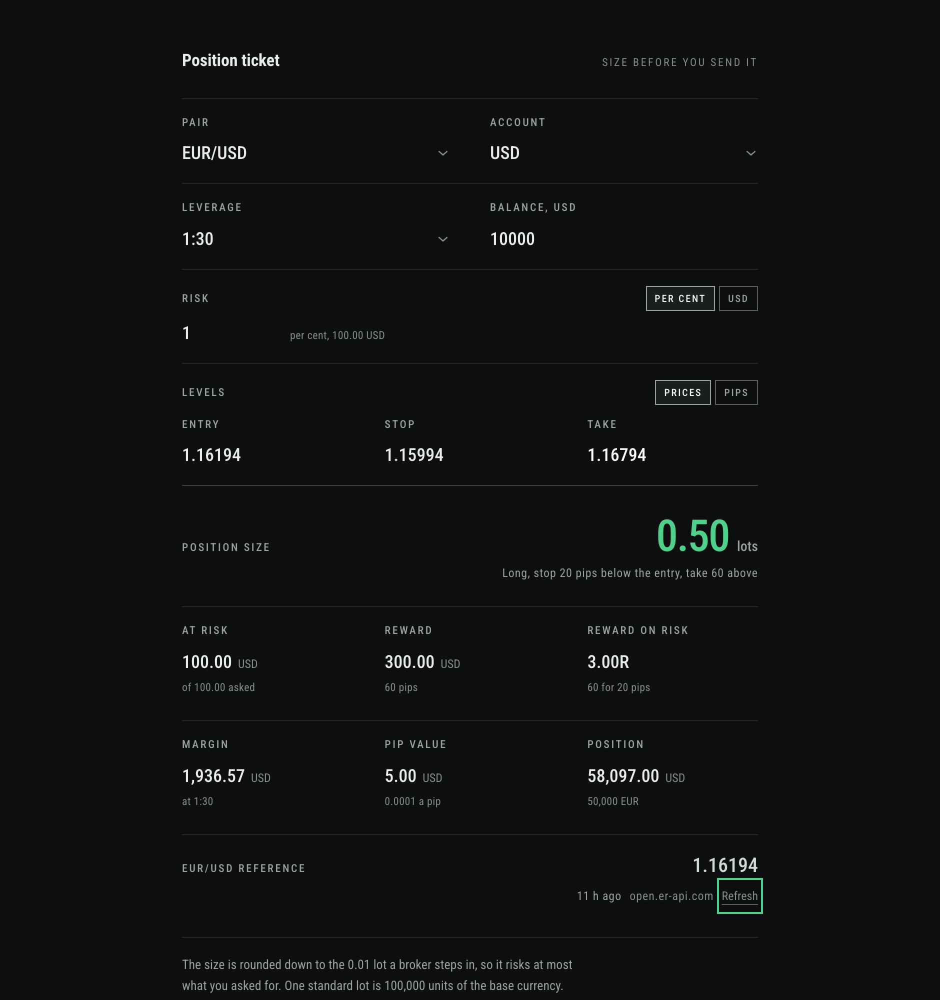
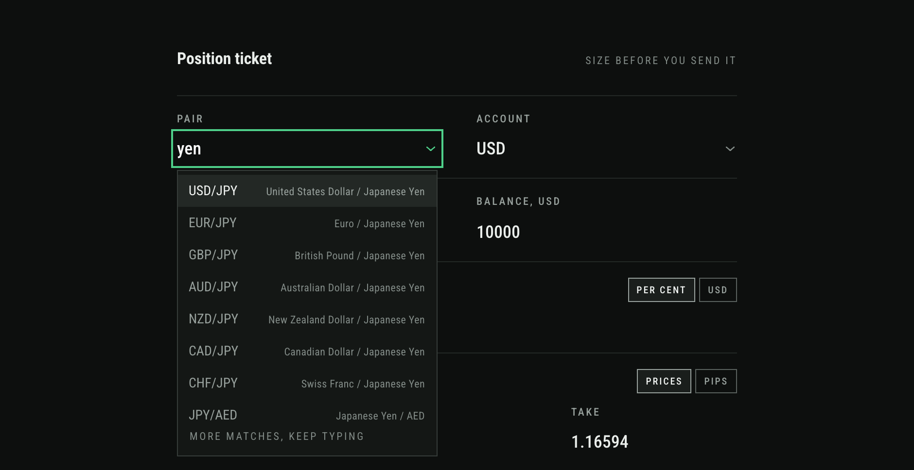
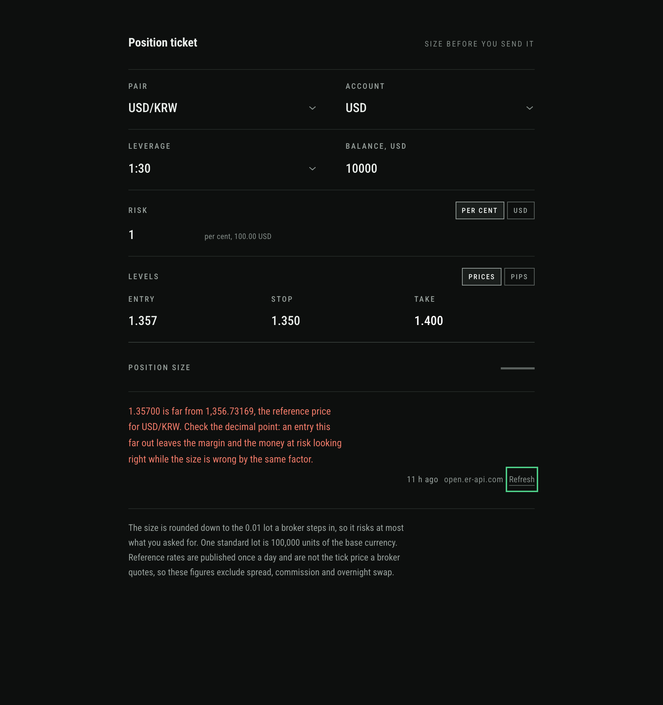
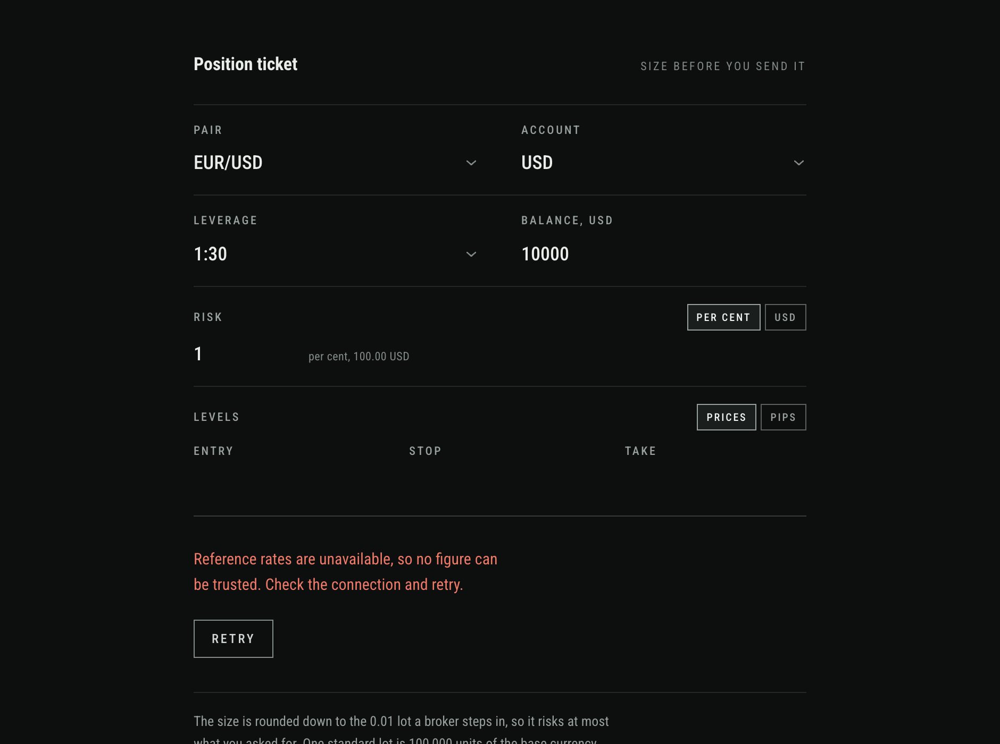
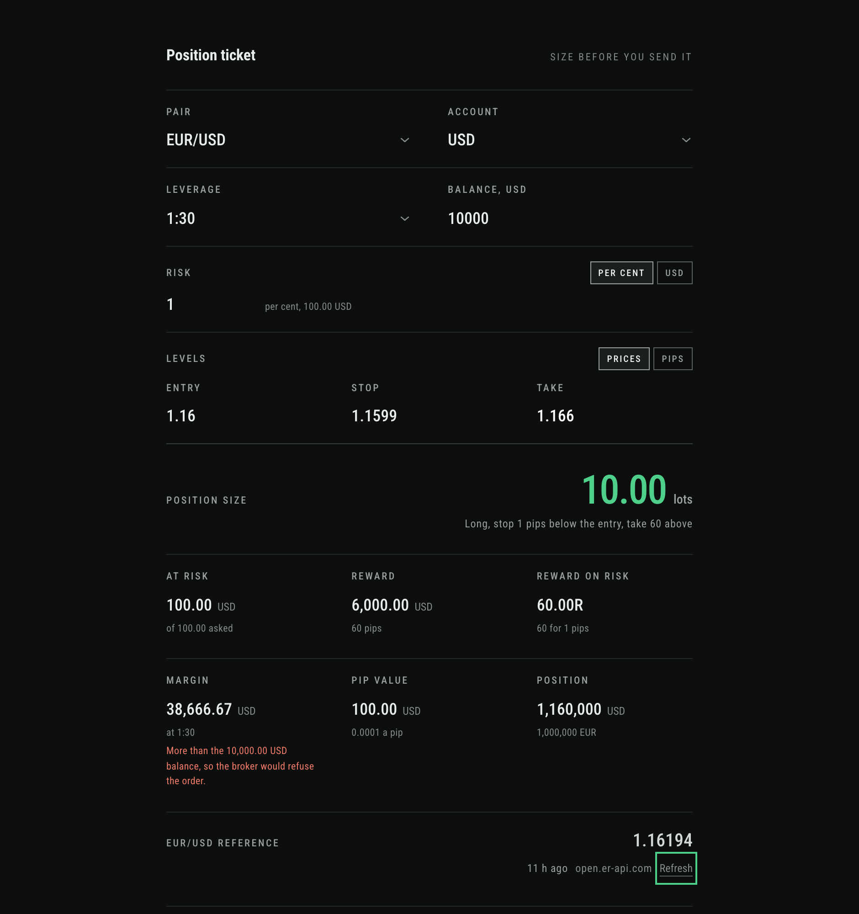

# Margin calculator

Work out how large a forex position may be before you open it.

You tell it the pair, where you plan to enter, where the stop goes and how much
of the account you are prepared to lose. It answers with the lot size to type
into the terminal, and with the margin the broker will lock against it.



## What it is for

Most calculators of this kind ask for a lot size and hand back the margin. That
answers the second question. The first one is how large the position is allowed
to be, given a stop that is where the chart says it should be and a loss you
have already decided you can take. Getting that backwards is how a stop ends up
moved to fit a size someone picked by feel.

So size is the output here. Everything else on the ticket exists to make that
one number trustworthy.

## Using it

1. **Pick the pair.** Start typing and it filters. A currency name works as well
   as the symbol, so `yen`, `JPY` and `usdjpy` all find USD/JPY.
2. **Set the account.** The currency your balance is in, your leverage, and the
   balance itself. Everything is reported in that currency.
3. **Say what you are risking.** Either a percent of the balance or a flat
   amount; the toggle switches, and both readings stay in step.
4. **Enter the levels.** Entry, stop and take, as prices or as distances in
   pips. Prices are prefilled from the reference rate, but they are yours to
   overwrite, and you should: you are looking at a live quote and this is not
   one.
5. **Read the size**, then the margin under it.



The size is rounded **down** to the 0.01 lot brokers step in, never up. Risking
100 over a 15 pip stop on EUR/USD gives 0.66 lots risking 99.00, not 0.67
risking 100.50. Rounding the other way would quietly put more on the line than
you asked for.

## What it will not answer

A calculator is dangerous when it returns something plausible and wrong, so
several inputs produce no size at all:

- **an entry far from the reference price.** Typing `1.357` where `1357` was
  meant leaves the margin, the notional and the money at risk all looking
  reasonable while the size is out by a factor of a thousand. That one is worth
  seeing:

  

- a stop sitting on the entry, or a level at or below zero
- a take on the same side of the entry as the stop
- a size under the 0.01 minimum, which means the stop is too wide for the risk
- rates that cannot be fetched at all, in which case nothing is shown rather
  than something stale

  

A margin larger than the balance is different. The arithmetic is right and the
broker would simply decline the order, so the size stands and the margin says
so:



## The arithmetic

```
pipValuePerLot = pipSize * 100000 * quoteToAccount
stopPips       = abs(entry - stop) / pipSize
riskAmount     = balance * riskPercent / 100, or the amount you typed
lots           = riskAmount / (stopPips * pipValuePerLot)
positionValue  = lots * 100000 * entry * quoteToAccount
requiredMargin = positionValue / leverage
reward         = abs(take - entry) / pipSize * pipValuePerLot * lots
```

One standard lot is 100,000 units of the base currency. A pip is a hundredth
for pairs quoted in yen or forint and a ten thousandth for everything else.

Anything priced against the base currency follows the entry you typed rather
than the fetched rate, because your entry is the better number.

## Rates

Rates come from `open.er-api.com`, which covers 166 currencies, with
`api.frankfurter.dev` on European Central Bank figures as a fallback. Neither
needs an API key.

**Both publish once a day.** These are reference rates, not the tick price your
broker quotes, and the figures exclude spread, commission and overnight swap.
The age of the rate sits next to the price and turns amber when it is past due;
under the fallback, which publishes no timestamp, a date is shown rather than
an invented age.

The pair list is not written into the code. The app takes the currency list the
feed returns and builds the pairs from it in conventional quoting order, which
comes to roughly 13,700. That includes pairs no broker sells and currencies
that quote in the thousands, which is exactly why the entry check above exists.

## Running it

```bash
npm install
npm start
```

Then open `http://localhost:4200`.

Angular 13 predates the Node releases in use today, but it builds, serves and
tests cleanly on them: verified on Node 16, 20 and 24, from a clean install
each time.

```bash
npm run build          # production build into docs/
npm test               # 227 specs, headless with --browsers=ChromeHeadless
npm run verify:css     # every class used in a template exists in the built CSS
```

Build with `npm run build` rather than `ng build`: a postbuild step writes the
single page fallback that the plain command leaves out.

`verify:css` exists because of a real bug. The templates once used a Tailwind
shade the pinned version did not ship, the utilities were dropped without a
word, and the form controls rendered white text on a white background. A class
that has no rule in the built CSS now fails the check by name.

## Deploying

`vercel.json` carries what a host needs, because this project does not build
where Angular's defaults expect. The build writes to `docs/` rather than
`dist/margin-calculator`, so a preset that assumes the default finds nothing to
publish.

```json
{
  "buildCommand": "npm run build",
  "outputDirectory": "docs",
  "installCommand": "npm ci"
}
```

`docs/` is not committed; the host builds it. There is no router here, one
screen and no routes, so no rewrite rule is needed. The `404.html` that the
postbuild step writes is a GitHub Pages convention and is simply unused
elsewhere.
